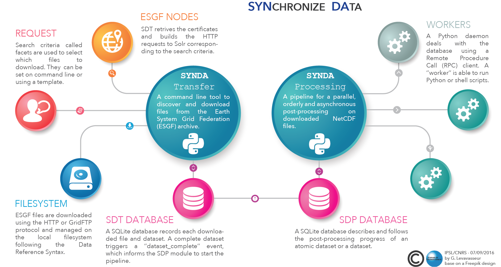

Synda documentation
=======================

Synopsis
********

``synda`` is a command line tool to search and download files from the Earth System Grid Federation (`ESGF <http://pcmdi.llnl.gov/>`_) archive.

Content
*******

.. toctree::
   :maxdepth: 1

   sdt/conda_install

.. toctree::
   :maxdepth: 2

   sdt/config

.. toctree::
   :maxdepth: 2

   sdt/usage

.. toctree::
   :maxdepth: 1

   files
   command_ref
   faq
   credits
   log
   license

Indices and tables
******************

* :ref:`genindex`
* :ref:`modindex`
* :ref:`search`