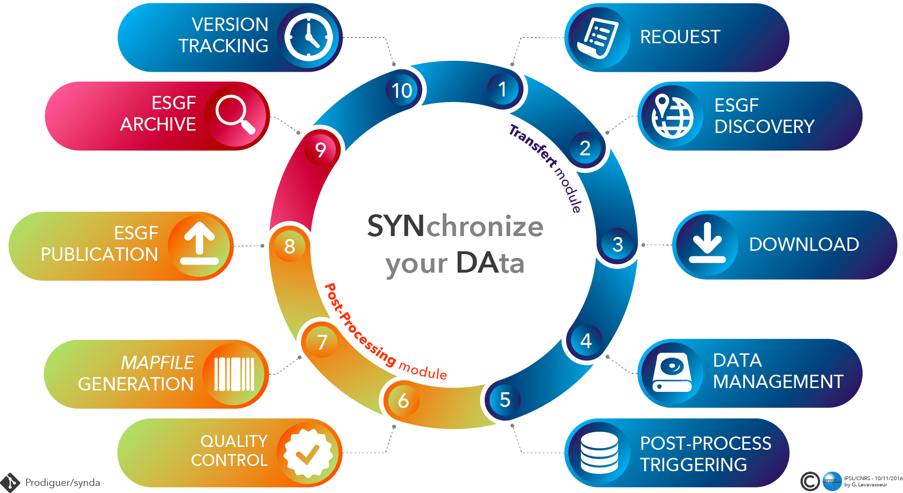

.. _replication-sdp:

ESGF replication
================

Introduction
************

This document describes how to implement a full ESGF replication pipeline:



Synda installation
******************

We highly recommend to install Synda modules on a dedicated virtual machine using :ref:`RPM <rpm-install-sdt>` or :ref:`DEB <deb-install-sdt>` packages. This machine will be called *synda-host* in the following.

See Synda installation from :ref:`RPM package <rpm-install-sdt>` or :ref:`DEB package <deb-install-sdt>`.

Then, install Synda post-processing module from :ref:`RPM package <rpm-install-sdp>` or :ref:`DEB package <deb-install-sdp>`.

However Synda needs to be installed as ``root`` on *synda-host*, it can be run with a normal user which is belonging to the ``synda`` Unix group.

.. note::

    The ``synda`` Unix group has to be declared by your system administrator prior to installation.
    All user id that are ``synda`` members will be able to run any ``synda [...]`` command.

Synda configuration
*******************

``sdt`` module
--------------

On *synda-host*:

- Set ``post_processing`` parameter to ``true`` in ``sdt.conf``.
- Set ``http_fallback`` parameter to ``true`` in ``sdt.conf``.
- Set ``check_parameter`` parameter to 0 in ``sdt.conf`` to allow Synda discovery on another index node than those specified in ``[index]`` section.
- Check the ``host`` parameter is the *synda-host* IP in ``sdt.conf``.

.. code-block:: text

    [module]
    post_processing=true
    ...
    [download]
    http_fallback=true
    ...
    [behaviour]
    check_parameter=0
    ...
    [post_processing]
    host=xxx.xxx.xxx.xx
    port=18290

- Choose a password to configure RPC server in ``credentials.conf``.
- Check the ESGF ``openid`` and ``password`` are valid in ``credentials.conf`` and register to appropriate ESGF groups.

.. code-block:: text

    [post_processing]
    username=sdpp
    password=xxxxxx
    ...
    [esgf_credential]
    openid=https://my.data.node/esgf-idp/openid/synda
    password=xxxxxxx

``sdp`` module
--------------

On *synda-host*:

- Set ``eventhread`` parameter to ``1`` in ``sdp.conf``.
- Check the ``host`` parameter is the *synda-host* IP in ``sdt.conf``.

.. code-block:: text

    [daemon]
    eventthread=1
    host=xxx.xxx.xxx.xx
    ...

- Copy the ``username`` and ``password`` in ``credentials.conf`` for RPC server from ``sdt`` configuration.

.. code-block:: text

    [rpcserver]
    username=sdpp
    password=xxxxxx

``sdw`` module
--------------

This is the client side post-processing module (aka "worker"). This single Python script is fully independent from the Synda stack and can be run remotely or not from *synda-host*.
We will call *worker-host* the remote machine where the worker executes your scripts. *synda-host* and *worker-host* has to be accessible by the network each other without firewall constraints, etc.

For instance, in the replication context, the Synda worker could be run on the ESGF data node used to publish the replicated data.

Target data to replicate
------------------------

Edit one or several selection file focusing the data you want to replicate. See :ref:`the selection file section <selection-file>`.

.. note::

    You can create many selection files (e.g. one per project). Selection file(s) must be stored in the "selection" folder.

Copy those selection files on *synda-host* into the selection folder. This folder is ``/etc/synda/sdt/selection`` by default or can be defined in ``/etc/synda/sdt/sdt.conf`` with the ``selection_path`` parameter. See :ref:`the synda configuration section <config-param-ref-sdt>`

.. warning::

    To allow Synda to discover files on another index node than those specified in the ``/etc/synda/sdt/sdt.conf``.
    You can use the ``searchapi_host`` selection file parameter.
    In that case, be careful to disable the facet checking in ``/etc/synda/sdt/sdt.conf`` using ``check_parameter=0``.

.. warning::

    Pay attention to any conflict with the default selection parameters that overwrite the selection file parameters.
    Default parameters are defined into specific templates in the default folder on *synda-host*.
    This folder is ``/etc/synda/sdt/default`` by default but can be defined in the synda configuration file using the ``default_path`` parameter. See :ref:`the synda configuration section <config-param-ref-sdt>`.

Build a republication pipeline
------------------------------

This republication pipeline is at least composed of 2 tasks to apply on each replicated dataset:
 - The mapfile generation,
 - The ESGF publication as replicas.

Pipeline definition
+++++++++++++++++++

On *synda-host*:

- Edit the file ``/etc/synda/sdp/pipeline/republication.py``. This file content must be:

.. code-block:: python

    import sppostprocessingutils

    def get_pipeline():
        return ppp

    # Piepline name
    name='republication'

    # Transitions/tasks list
    tasks=['mapfile','publication']

    ppp = sppostprocessingutils.build_light_pipeline(name, tasks)


- Edit the file ``/etc/synda/sdp/pipeline/spbindings.py``. This file content must be:

.. code-block:: python

    import spconst

    # Mapping: a 'key' event into the corresponding tuple of 'value' pipeline with starting 'status'
    event_pipeline_mapping = {
        spconst.EVENT_DATASET_COMPLETE: ('republication', spconst.PPPRUN_STATUS_WAITING)
    }

.. note::

    You can easily manage your pipeline definitions in another folder by using the ``pipeline_path`` parameter in ``sdp.conf``. See :ref:`the synda configuration section <config-param-ref-sdp>`.

Scripts
+++++++

A transition name has to be the same as the script you want to apply as post-process.
Due to the RPC server connexion, those scripts can be run outside of *synda-host*. See the worker configuration below. This is very useful for intensive computing process that requires cluster infrastructure.

.. warning::

    Whether your scripts are run remotely or not, all the required dependencies, libraries, compiler, etc. have to be installed on *synda-host* or *worker-host*.

- Edit ``mapfile.sh`` that will generate mapfiles using the ```esgprep mapfile`` command-line <http://is-enes-data.github.io/esgf-prepare/>`_. The script content should like:

.. code-block:: bash

   #!/bin/bash -e

   # Description
   #   This script generates ESGF mapfile.
   #   Processes by dataset.

   # --------- arguments & initialization --------- #

   while [ "${1}" != "" ]; do
       case "${1}" in
           "--project")          shift; project="${1}"          ;;
           "--dataset_pattern")  shift; input_dataset="${1}"    ;;
       esac
       shift
   done

   ESGCET_PATH="/esg/config/esgcet/"

   # --------- main --------- #

   msg "INFO" "mapfile.sh started"

   esgprep mapfile -i ${ESGCET_PATH} -v \
                   --project ${project,,} \
                   --log \
                   --max-threads 16 \
                   --no-cleanup \
                   ${input_dataset}

   msg "INFO" "mapfile.sh complete"

- Edit and configure ``publication.sh`` that will publish the generated mapfile as replica. The script content should like:

.. code-block:: bash

   #!/bin/bash -e

   # Description
   #   This script publishes mapfiles.
   #   Processes by dataset.

   # --------- arguments & initialization --------- #

   while [ "${1}" != "" ]; do
       case "${1}" in
           "--project")          shift; project="${1}"          ;;
           "--dataset_pattern")  shift; input_dataset="${1}"    ;;
       esac
       shift
   done

   # INI files directory
   ESGCET_PATH="/esg/config/esgcet/"
   # Indexnode hostname
   MYPROXY_HOST="esgf-node.fr"
   # myproxy-logon port
   MYPROXY_PORT="7512"
   # Publisher's openID login registered
   MYPROXY_LOGIN="xxxxxx"
   # Publisher's openID password
   MYPROXY_PASSWD="xxxxxx"

   # --------- main --------- #

   msg "INFO" "replication.sh started"

   # Loads ESGF environment
   source /etc/esg.env

   # Checkup directories and temporary files
   if [ ! -d ${ESGCET_PATH} ]; then
       msg "ERROR" "${ESGCET_PATH} does not exist. STOP." >&2
       exit 1
   fi
   if [ ! -d ${HOME}/.globus ]; then
       msg "ERROR" "${HOME}/.globus does not exist. STOP." >&2
       exit 1
   fi
   if [ -f ${HOME}/.globus/certificate-file ]; then
       msg "WARNING" "${HOME}/.globus/certificate-file already exists. Deleted." >&2
       rm -f ${HOME}/.globus/certificate-file
   fi

   # Retrieve mapfile name with an esgprep dry run
   uuid=$(uuidgen)
   esgprep mapfile -i ${ESGCET_PATH} -v \
                   --project ${project,,} \
                   --no-checksum \
                   --mapfile "{dataset_id}.${uuid}" \
                   ${input_dir} 1>&2 2> /dev/null
   mapfile_orig=$(ls /tmp/map | grep "${uuid}")
   mapfile=$(echo ${mapfile_orig} | sed "s|\.${uuid}||g")
   rm -fr /tmp/map/${mapfile_orig}

   # Gets proxy certificates for publication
   msg "INFO"  "Get ESGF certificates..."
   cat ${MYPROXY_PASSWD} | myproxy-logon -b -T -s ${MYPROXY_HOST} -p ${MYPROXY_PORT} -l ${MYPROXY_LOGIN} -o ${HOME}/.globus/certificate-file -S

   # Initialize node and controlled vocabulary
   esginitialize -c -i ${ESGCET_PATH}

   msg "INFO"  "Publishing ${mapfile} on datanode..."
   # Datanode publication
   esgpublish -i ${ESGCET_PATH} \
              --project ${project,,} \
              --thredds \
              --service fileservice \
              --set-replica \
              --map ${mapfile_dir}${mapfile}
   msg "INFO"  "Publishing ${mapfile} on indexnode..."
   #Indexnode publication
   esgpublish -i ${ESGCET_PATH} \
              --project ${project,,} \
              --publish \
              --noscan \
              --service fileservice \
              --set-replica \
              --map ${mapfile_dir}${mapfile}

   msg "INFO" "replication.sh complete"

File discovery
**************

Install your selection file on *synda-host*:

.. code-block:: bash

    synda install -s <selection-file>

Or upgrade the file discovery:

.. code-block:: bash

    synda upgrade

At this point, files metadata are stored in local database and data download can begin.

Files download
**************

To start the download, run command below on *synda-host*:

.. code-block:: bash

    service sdt start

At this point, the downloading is in progress and when a dataset is complete an event is create to trigger the corresponding pipeline creation.

Files processing
****************

To start the post-processing, run command below on *synda-host*:

.. code-block:: bash

    service sdp start

At this point, the downloading is in progress and the previous event are consumed by ``sdp`` to create appropriate pipeline entries into the database.
The first transition of each complete dataset has a "waiting" status.

Then, run the worker remotely (i.e., on *worker-host*) or not (i.e., on *synda-host*):

.. code-block:: bash

    synda_wo -H <synda-host-IP> -w <rpc-password> --script_dir /your/scripts

At this point, the worker communicates with the ``sdp`` database to pick up information on a dataset pending for a transition to apply.
The worker run the corresponding script and returns the job result to ``sdp``. On success, the transition is set to "done" and replaced by the next one.

The worker can be run as a daemon using the ``start``, ``stop`` and ``status`` command:

.. code-block:: bash

    synda_wo -H <synda-host-IP> -w <rpc-password> --script_dir /your/scripts start

The worker allows you to:

- Pick up only one item to process from ``sdp``:

.. code-block:: bash

    synda_wo -H <synda-host-IP> -w <rpc-password> --script_dir /your/scripts -1

- Filter the transitions to process:

.. code-block:: bash

    synda_wo -H <synda-host-IP> -w <rpc-password> --script_dir /your/scripts -j mapfile

- Filter the pipeline to process:

.. code-block:: bash

    synda_wo -H <synda-host-IP> -w <rpc-password> --script_dir /your/scripts -p republication

By default, the worker log is ``/var/log/sdw/worker.log``. On *worker-host* you must submit a log directory:

.. code-block:: bash

    synda_wo -H <synda-host-IP> -w <rpc-password> --script_dir /your/scripts -l /my/logs