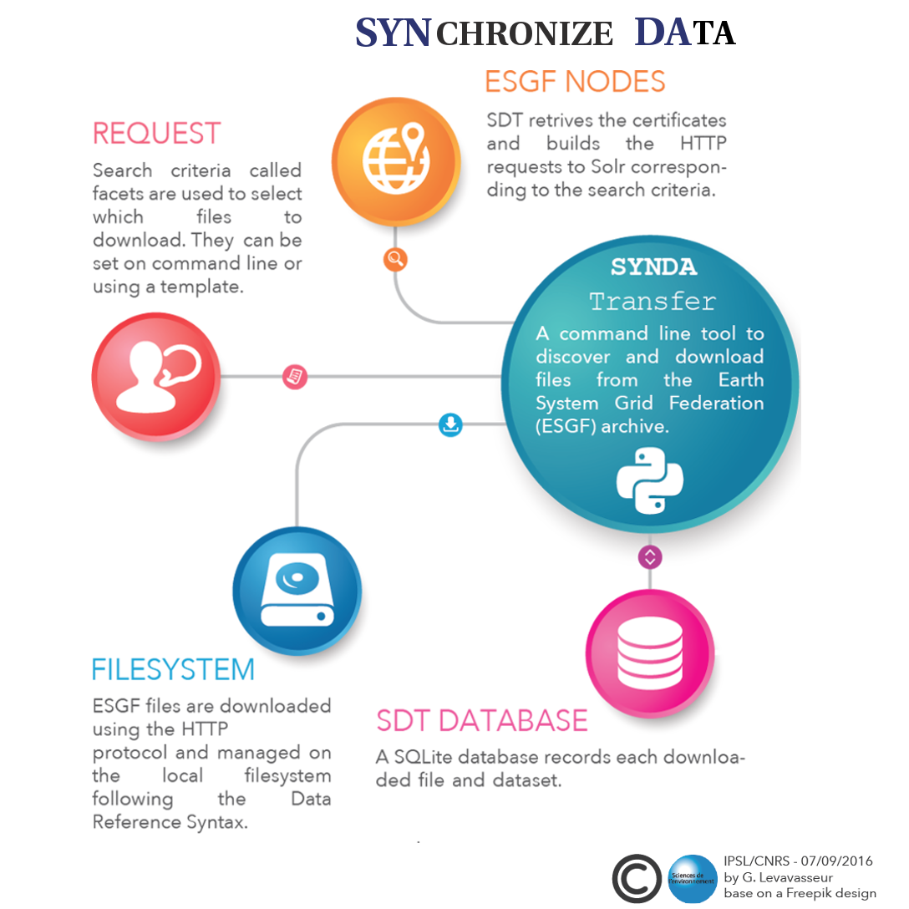

Synda documentation
===================

Synopsis
********

*synda* is a command line tool to search and download files from the Earth System Grid Federation (`ESGF <http://pcmdi.llnl.gov/>`_) archive.

Content
*******

.. toctree::
    :caption: Table of contents
    :maxdepth: 5

    overview.rst
    conda_install.rst
    src_install.rst
    upgrade_guide.rst
    upgrade_src.rst
    user_guide.rst
    configuration_parameter_reference.rst
    files.rst
    command_reference.rst
    advanced_configuration_parameter_reference.rst
    howto_and_tutorial.rst
    download_tutorial.rst
    selection_file.rst
    selection_file_parameter_reference.rst
    download_nearest_replica.rst
    replication.rst
    select_indexes.rst
    faq.rst
    log.rst
    project.rst

    credits.rst
    license.rst

Indices and tables
******************

* :ref:`genindex`
* :ref:`modindex`
* :ref:`search`